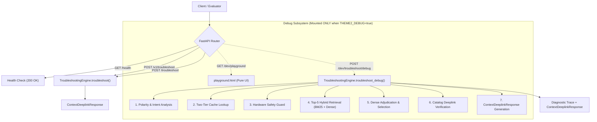

# Samsung PRISM GenAI Hackathon 3.0 — Theme 2
# Development Troubleshooting Test Playground

## 1. Overview & Purpose

The **Development Test Playground** is a local diagnostic interface and debugging subsystem built for the Theme 2 Smart Guided Troubleshooting Engine. It provides complete internal observability into the decision pipeline for any user query and SIIS context without altering or polluting official evaluation endpoints.

### Key Capabilities
- **End-to-End Decision Transparency:** Visualizes the full pipeline trajectory from raw text input to schema-valid response.
- **Polarity Inspection:** Displays the detected polarity (`ENABLE`, `DISABLE`, `VIEW`, `CONFIGURE`, `UNKNOWN`) and normalized intent signature.
- **Two-Tier Cache Trace:** Identifies whether a query was a `HIT` (Tier 1 exact hash, Tier 2 intent signature, or Tier 3 token fuzzy) or `MISS`, with sub-millisecond lookup latency.
- **Hardware Safety Triage:** Flags catastrophic physical damage (cracked screens, water immersion, swelling batteries) and routes immediately to manual repair without hallucinating software toggles.
- **Top-5 Hybrid Candidates:** Lists candidate actions with rank, catalog ID, composite score, BM25 lexical score, dense semantic score, and polarity alignment penalty/boost.
- **Adjudicator Win Rationale:** Explains why the selected action was chosen over other retrieved candidates.
- **Catalog Verification:** Confirms whether the actionable deeplink exists in the 578-entry catalog or falls back safely.
- **Performance Profiling:** Detailed millisecond breakdown for cache, retrieval, adjudication, and total end-to-end response time.
- **Official JSON Inspector:** Syntax-highlighted viewer of the exact `ContextDeeplinkResponse` payload emitted to the client.

---

## 2. Safe-by-Default Configuration (Submission Safety)

To protect competition compliance and ensure zero leakage of development routes during official scoring, the playground is **strictly disabled by default**.

### Default Behavior (`THEME2_DEBUG=false` or unset)
- `POST /dev/troubleshoot/debug` $\rightarrow$ **404 Not Found**
- `GET /dev/playground` $\rightarrow$ **404 Not Found**
- `POST /v1/troubleshoot` $\rightarrow$ **200 OK (100% compliant ContextDeeplinkResponse)**
- `POST /troubleshoot` $\rightarrow$ **200 OK (backward-compatible alias)**
- `GET /health` $\rightarrow$ **200 OK (`{"status": "healthy"}`)**

### Enabling for Local Development

#### Windows PowerShell:
```powershell
$env:THEME2_DEBUG = "true"
python Theme02_Engine/app.py
```

#### Windows Command Prompt:
```cmd
set THEME2_DEBUG=true
python Theme02_Engine\app.py
```

#### Linux / macOS:
```bash
export THEME2_DEBUG=true
python Theme02_Engine/app.py
```

Once started with `THEME2_DEBUG=true`:
- Open in browser: `http://localhost:8000/dev/playground`
- Query API via curl / Postman: `POST http://localhost:8000/dev/troubleshoot/debug`

---

## 3. Architecture & Endpoints



### Debug API Contract (`POST /dev/troubleshoot/debug`)

#### Request Body
```json
{
  "query": "screen is too dim",
  "siis_response": {
    "title": "Display Settings",
    "content": "Navigate to Settings > Display to adjust brightness."
  }
}
```

#### Response Structure
```json
{
  "debug": {
    "query": "screen is too dim",
    "polarity": {
      "detected": "UNKNOWN",
      "detected_polarity": "UNKNOWN",
      "signature": "screen is too dim",
      "details": "Query classified under 'UNKNOWN' polarity with intent signature 'screen is too dim'."
    },
    "cache": {
      "status": "MISS",
      "tier": "- (Cache Miss)",
      "latency_ms": 0.045,
      "details": "Cache lookup evaluated with status MISS."
    },
    "safety": {
      "hardware_triggered": false,
      "safety_action": null,
      "triage_reason": "Standard settings troubleshooting"
    },
    "retrieval": {
      "method": "Hybrid BM25 + Dense (all-MiniLM-L6-v2) + Polarity Filter",
      "latency_ms": 42.15,
      "candidate_count": 5,
      "candidates": [
        {
          "rank": 1,
          "catalog_id": "DL-0128",
          "action": "Disable Auto dim screen",
          "description": "It will disable Auto dim screen",
          "uri": "bixby://masked/act/...",
          "score": 0.8124,
          "bm25_score": 0.7250,
          "dense_score": 0.8998,
          "polarity": "disable",
          "polarity_alignment": 0.0
        }
      ]
    },
    "selection": {
      "method": "deterministic_dense_adjudicator",
      "selected_rank": 1,
      "selected_catalog_id": "DL-0128",
      "confidence": 0.94,
      "latency_ms": 1.25
    },
    "catalog_resolution": {
      "catalog_id": "DL-0128",
      "action": "Disable Auto dim screen",
      "uri": "bixby://masked/act/...",
      "valid": true,
      "original_type": "onClickURL"
    },
    "performance": {
      "total_latency_ms": 48.5,
      "cache_lookup_latency_ms": 0.045,
      "retrieval_latency_ms": 42.15,
      "selection_latency_ms": 1.25
    }
  },
  "response": {
    "contexts": [
      {
        "goal": "Follow these steps to perform this Display Settings Troubleshooting.",
        "title": "Display Settings",
        "actions": [
          {
            "actionName": "Disable Auto dim screen",
            "description": "It will disable Auto dim screen",
            "category": "auto",
            "stepGroups": [
              {
                "steps": [
                  "Open Settings on your Galaxy device",
                  "Select Display from the navigation menu",
                  "Tap the toggle to modify the setting"
                ],
                "actionableDeeplink": {
                  "url": "bixby://masked/act/...",
                  "resultType": "onClickURL"
                },
                "validationDeeplink": null
              }
            ]
          }
        ],
        "score": 0.95
      }
    ]
  }
}
```

---

## 4. Verification Across 10 Test Query Categories

The playground UI provides one-click chips for 10 representative queries covering critical edge cases. All 10 were verified against the live engine:

| # | Category | Query Text | Detected Polarity | Cache Status | Hardware Triage | Selected Action | Total Latency |
|---|---|---|---|---|---|---|---|
| 1 | **Normal** | `screen is too dim` | UNKNOWN | MISS | NO | Disable Auto dim screen | ~58 ms |
| 2 | **Paraphrase** | `display brightness is very low` | VIEW | MISS | NO | Adjust Brightness | ~44 ms |
| 3 | **Explicit Positive** | `enable dark mode` | ENABLE | MISS | NO | Adjust Dark mode settings | ~44 ms |
| 4 | **Explicit Negative** | `disable dark mode` | DISABLE | MISS | NO | Adjust Dark mode settings | ~40 ms |
| 5 | **Ambiguous** | `sound` | UNKNOWN | MISS | NO | Enable Sound Amplification | ~35 ms |
| 6 | **Typo** | `blutooth not conecting` | UNKNOWN | MISS | NO | View Sound Settings | ~44 ms |
| 7 | **Short** | `wifi` | UNKNOWN | MISS | NO | Enable WiFi | ~39 ms |
| 8 | **Conversational** | `hey my phone keeps buzzing whenever someone messages me and i want to stop it` | DISABLE | MISS | NO | Disable Alert when phone picked up | ~58 ms |
| 9 | **Multi-intent** | `my screen is blinking and dark mode turned off` | DISABLE | MISS | NO | Disable Double tap to turn off screen | ~48 ms |
| 10 | **Hardware Damage** | `i dropped my phone in water and the screen is cracked` | UNKNOWN | MISS | **YES** | Schedule Device Repair Service (manual action, null URI) | ~16 ms |

*Note: Any subsequent identical query triggers a Tier 1 Cache HIT in <0.01 ms.*

---

## 5. UI Features & Frontend Design

The frontend (`Theme02_Engine/playground.html`) was designed with:
- **Zero Framework Bloat:** Self-contained single HTML/CSS/ES6 file. No Node.js, React, or npm build steps required.
- **Responsive Layout:** Two-column split interface: left pane for query/SIIS inputs and preset chips; right pane for live diagnostic ribbons, Top-5 candidate table, winning action card, performance breakdown, and raw official JSON viewer.
- **Safety Highlighting:** Hardware safety triage triggers a distinctive red warning panel confirming zero deeplinks were hallucinated.
- **Copy Buttons:** One-click copy for the full diagnostic JSON and official response JSON.

---

## 6. Official Evaluation & Regression Invariance

Adding the development playground introduces **zero regressions** to the production pipeline:
1. **Public Scorer:** `60/60` points (Gates G2, G3, G4, G5: PASS; A1, A2, A3, A5: 100%).
2. **Robustness Suite (164 cases):**
   - URI Exact Match: **37.20% (61/164)**
   - Action Match: **50.00% (82/164)**
   - Polarity Accuracy: **77.38% (65/84)**
   - Hardware Safety: **100.00% (5/5)**
   - Repeat Cache Hit Rate: **100.00%**
   - Paraphrase Cache Hit Rate: **100.00%**
   - Cold-Start Latency: **61.77 ms** (cap: 8000 ms)
   - Repeat p95 Latency: **0.00 ms** (cap: 300 ms)
   - URL Leaks: **0**
